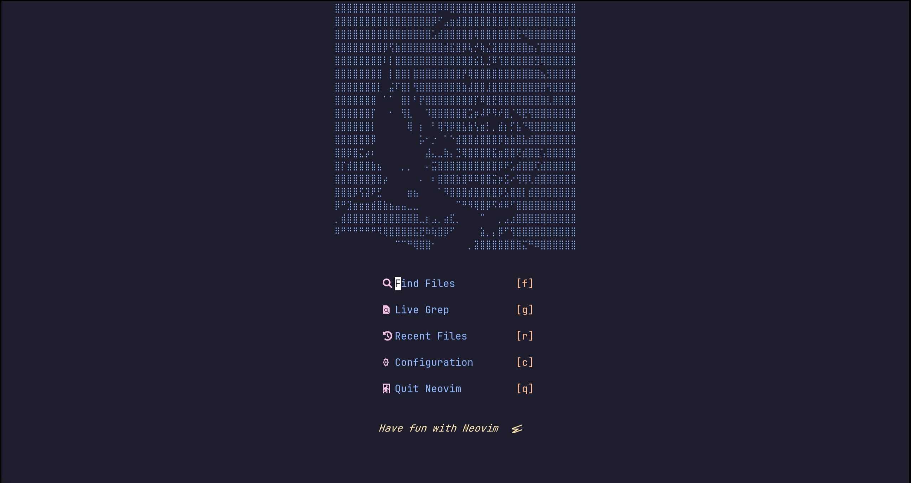
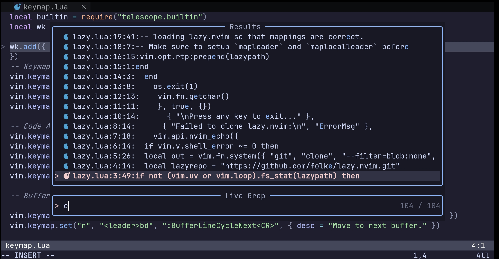
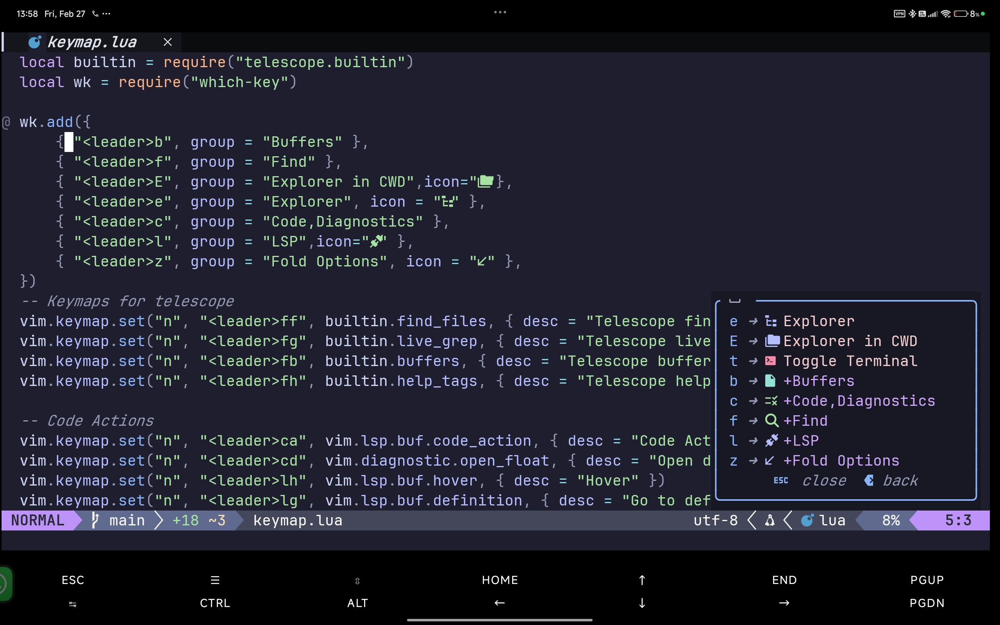
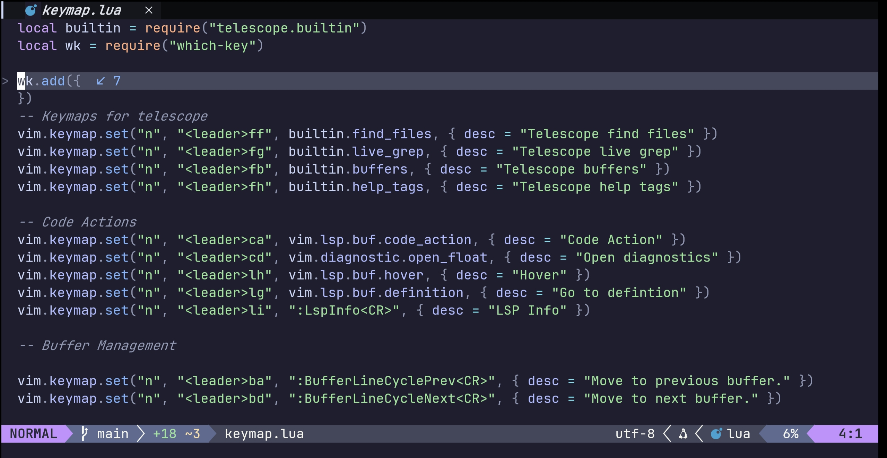

# 🚀 Minimalist & Modern Neovim

A blazing fast, lightweight Neovim configuration designed for efficiency and aesthetics. This setup balances a **minimal footprint (21 plugins)** with a full-featured IDE experience.



## ✨ Highlights

* **⚡ Ultra Lightweight:** Only **21 carefully selected plugins** to keep startup times near-instant.
* **🎨 Catppuccin Theme:** A soothing, high-contrast color palette for long coding sessions.
* **🧩 Modern UI:** Featuring a custom ASCII dashboard via `dashboard-nvim`.
* **🔍 Fuzzy Finding:** Full integration with `telescope.nvim` for files and live grep.
* **⌨️ Discoverable:** Never forget a shortcut with `which-key.nvim` suggestions.

---

## 🛠️ Features

### LSP & Development
* **Mason.nvim:** Automated management for LSP servers, DAP, linters, and formatters.
* **Blink.cmp:** Next-generation, high-performance autocompletion engine.
* **Language Support:** Built-in support for **Python** and **JavaScript** out of the box.
* **Code Folding:** Enhanced folding options for better codebase navigation.

### Workflow & Terminal
* **ToggleTerm:** Access a floating terminal instantly with a simple toggle.
* **Fuzzy Finder:** Search through code and files using Telescope’s powerful UI.

---

## 📸 Screenshots

### 🖥️ Dashboard & Interface
The entry point to your workflow—clean, fast, and informative.


### 🔍 Search & Discovery
Fuzzy find and Live Grep across your entire project with a floating UI.


### ⌨️ Keybinding Hints
Interactive `which-key` menus help you navigate your custom mappings effortlessly.


### ⚙️ Clean Configuration
A modular Lua-based config that is easy to read and extend.


---

## 📦 Core Plugin Stack

| Category | Plugins |
| :--- | :--- |
| **Package Manager** | `lazy.nvim` |
| **Completion** | `blink.cmp` |
| **LSP / Tooling** | `nvim-lspconfig`, `mason.nvim` |
| **UI / Theme** | `dashboard-nvim`, `catppuccin` |
| **Navigation** | `telescope.nvim` |
| **Utilities** | `which-key.nvim`, `toggleterm.nvim` |

---

## 🚀 Installation

1. Ensure you have **Neovim 0.10+** installed.
2. Clone this repository into your config folder:
   ```bash
   git clone https://github.com/IamShivanshCoder/nvim-dotfiles.git ~/.config/nvim
